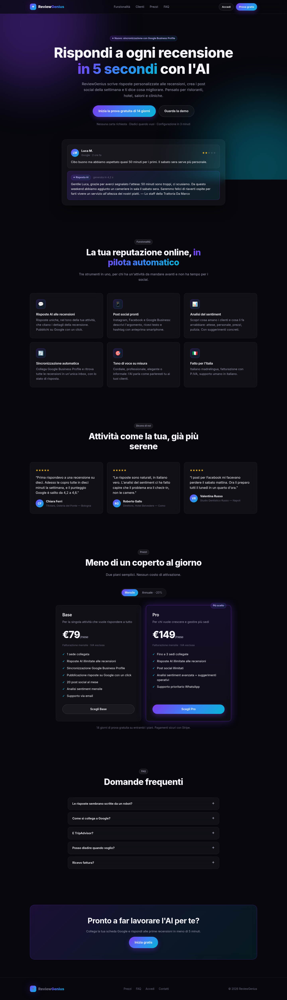

# ReviewGenius

Micro-SaaS B2B per attività locali (ristoranti, hotel, saloni, cliniche dentali):

1. **Risposte AI alle recensioni** (Google e TripAdvisor) in pochi secondi, con pubblicazione diretta su Google.
2. **Post social** per Instagram, Facebook e Google Business, con anteprima smartphone.
3. **Analisi del sentiment** con i temi ricorrenti (attese, personale, prezzi…) e suggerimenti operativi.



Piani: **Base** €79/mese (€63 annuale) · **Pro** €149/mese (€119 annuale) · prova gratuita di 14 giorni.

## Stack

| Livello      | Tecnologia                                                        |
| ------------ | ----------------------------------------------------------------- |
| Framework    | Next.js 15 (App Router, JavaScript), React 19                     |
| Stile        | CSS vanilla (`src/app/globals.css`): dark mode, glassmorphism     |
| Database     | PostgreSQL (Supabase) + Prisma                                    |
| Auth         | NextAuth v4: email/password + Google OAuth                        |
| AI           | OpenAI Chat Completions (`OPENAI_MODEL`, default `gpt-4o-mini`)    |
| Pagamenti    | Stripe Checkout, Customer Portal e webhook                        |
| Recensioni   | Google Business Profile API                                       |

> Il documento di handoff indicava Next.js 14. Tutte le versioni 14.x hanno vulnerabilità critiche
> (tra cui un'esecuzione di codice remota non autenticata), corrette solo dalla 15.5.24 in poi:
> per questo il progetto usa Next 15.5.

## Avvio rapido (modalità demo)

```bash
npm install
npm run dev
```

Apri http://localhost:3000 e accedi con **demo@reviewgenius.it / demo1234**.
Senza variabili d'ambiente tutto funziona con dati di esempio: ogni integrazione si attiva appena
ne inserisci la chiave in `.env.local` (vedi `.env.example`).

## Struttura

```
prisma/
  schema.prisma          # User, Account, Business, Review, GeneratedPost
  seed.mjs               # utente demo con recensioni di esempio
src/
  app/
    page.js              # landing page
    pricing/ login/ register/
    dashboard/           # overview, reviews, content, analytics, settings
    api/
      auth/[...nextauth] # NextAuth
      register           # registrazione email/password
      generate-response  # risposta AI a una recensione
      generate-content   # post social AI (GET: ultimi post)
      reviews            # GET lista + statistiche, POST inserimento manuale
      reviews/sync       # importa le recensioni da Google
      reviews/[id]/reply # salva bozza / pubblica su Google
      business           # impostazioni attività
      google/locations   # sedi Google dell'utente
      stripe             # crea la sessione di Checkout
      stripe/portal      # Customer Portal
      stripe/webhook     # sincronizza lo stato dell'abbonamento
  components/landing/    # Navbar, Hero, Features, Testimonials, PricingCards, FAQ, Footer
  components/dashboard/  # Sidebar, Header, StatsCards, ReviewList, ReviewModal, ContentGenerator, SentimentChart…
  lib/                   # env, prisma, auth, ai, openai, stripe, google, data, plans, mock-data
```

## Prossimi step: configurazione di produzione

### 1. Database (Supabase)

1. Crea un progetto su https://supabase.com (regione: Europa, per esempio Francoforte).
2. In *Project Settings → Database → Connection string*:
   - `DATABASE_URL` = stringa del **pooler in modalità transaction** (porta 6543), aggiungendo `?pgbouncer=true&connection_limit=1`
   - `DIRECT_URL` = stringa della **connessione diretta** (porta 5432)
3. Crea le tabelle: `npx prisma migrate dev --name init` (in locale) oppure `npm run db:push`.
4. Facoltativo: `npm run db:seed` crea l'utente demo con recensioni di esempio.

### 2. Autenticazione

- `NEXTAUTH_SECRET`: `openssl rand -base64 32`
- `NEXTAUTH_URL`: l'URL pubblico, per esempio `https://reviewgenius.it`

### 3. Google (login + recensioni reali)

1. Su https://console.cloud.google.com crea un progetto e configura la *OAuth consent screen*
   (tipo *External*), aggiungendo lo scope `https://www.googleapis.com/auth/business.manage`.
2. Crea le credenziali *OAuth client ID → Web application* con il redirect URI
   `https://TUO-DOMINIO/api/auth/callback/google` (e `http://localhost:3000/api/auth/callback/google` per lo sviluppo).
3. Abilita le API **My Business Account Management**, **My Business Business Information** e
   **Google My Business API**.
4. **Importante:** Google concede l'accesso alla Business Profile API solo dopo una richiesta
   (modulo "GBP API access request" nella documentazione di Google). Va fatta subito perché
   l'approvazione può richiedere alcuni giorni. Finché non arriva, gli endpoint rispondono con 403.
5. Lo scope `business.manage` è *sensibile*: per uscire dalla modalità "Testing" (limitata a 100 utenti
   di test) serve la verifica dell'app da parte di Google.

Una volta configurato, l'utente va in *Impostazioni → Collega Google*, sceglie la sede e poi usa
*Recensioni → Sincronizza Google*. TripAdvisor non offre un'API pubblica per le risposte: le
recensioni si incollano a mano (*+ Aggiungi recensione*) e la risposta si copia.

### 4. OpenAI

`OPENAI_API_KEY` da https://platform.openai.com/api-keys. Il modello si sceglie con `OPENAI_MODEL`
(`gpt-4o-mini` è economico e più che sufficiente per le risposte brevi).

### 5. Stripe

1. Crea 2 prodotti (Base, Pro), ciascuno con 2 prezzi ricorrenti in EUR:
   - Base: €79/mese, €756/anno · Pro: €149/mese, €1.428/anno
2. Copia i Price ID in `STRIPE_PRICE_BASE_MONTHLY`, `STRIPE_PRICE_BASE_YEARLY`, `STRIPE_PRICE_PRO_MONTHLY`
   e `STRIPE_PRICE_PRO_YEARLY`.
3. Crea il webhook su `https://TUO-DOMINIO/api/stripe/webhook` con gli eventi
   `checkout.session.completed`, `customer.subscription.created`, `customer.subscription.updated`
   e `customer.subscription.deleted`, poi copia il signing secret in `STRIPE_WEBHOOK_SECRET`.
   In locale: `stripe listen --forward-to localhost:3000/api/stripe/webhook`.
4. Attiva il **Customer Portal** (*Settings → Billing → Customer portal*) e, per la fatturazione
   italiana, *Stripe Tax* oppure le fatture automatiche con la tua P.IVA.

### 6. Deploy su Vercel

1. Importa il repository su https://vercel.com/new (il framework viene rilevato in automatico;
   il build esegue `prisma generate && next build`).
2. Inserisci tutte le variabili di `.env.example` in *Settings → Environment Variables*, con
   `NEXT_PUBLIC_APP_URL` e `NEXTAUTH_URL` impostati sul dominio di produzione.
3. Dopo il primo deploy esegui le migrazioni sul database di produzione:
   `DATABASE_URL=... DIRECT_URL=... npx prisma migrate deploy`.
4. Dominio: *Settings → Domains → Add* `reviewgenius.it`, poi configura il DNS dal registrar
   (record A `76.76.21.21` per il dominio principale, CNAME `cname.vercel-dns.com` per `www`).
5. Aggiorna gli URL di redirect di Google OAuth e del webhook Stripe con il dominio definitivo.

## Prima del lancio

- [ ] Sostituire le testimonianze segnaposto (`src/components/landing/Testimonials.js`) con quelle di clienti reali.
- [ ] Aggiungere Privacy Policy, Cookie Policy e Termini di servizio (obbligatori per GDPR e per la verifica Google OAuth).
- [ ] Limiti per piano: oggi l'accesso è controllato solo da prova/abbonamento attivo; i limiti
      "1 sede / 3 sedi" e "20 post al mese" non sono ancora applicati lato server.
- [ ] Sincronizzazione automatica periodica (per esempio Vercel Cron su `/api/reviews/sync` per ogni attività).
- [ ] Reset password via email (oggi solo login con password o Google).
